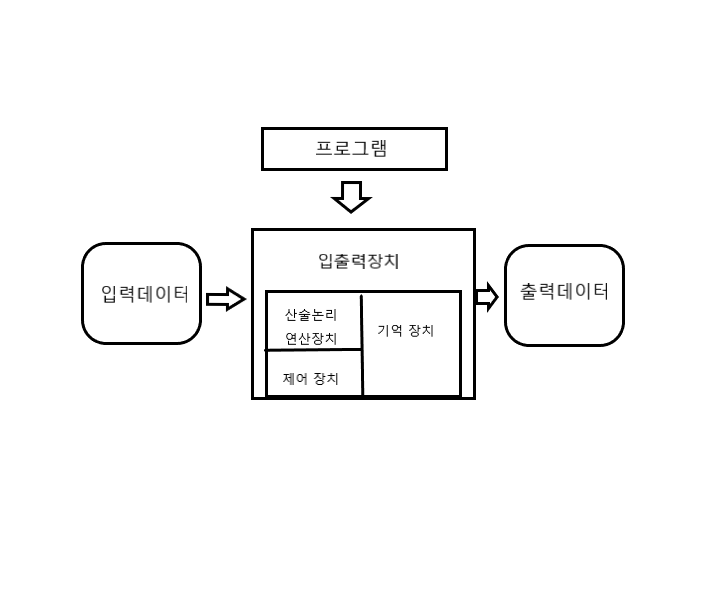
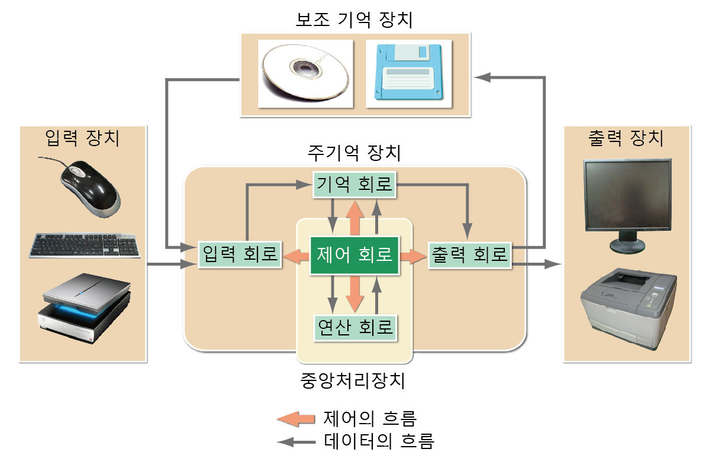

# CS 개론

## 1. 컴퓨터와 자료

### (1) 컴퓨터 란?

+ 자료 처리기(data processor)
    - 자료를 처리하는 기계 ( 입력을 받으면 자료를 처리하여 출력함)
    - 현대 컴퓨터의 기능적 측면("입력 - 처리 - 출력") 만 정의 > 너무 포괄적이다.
        * ex) 계산기도 컴퓨터라고 생각할수 있음
    - 컴퓨터를 정의하면 **프로그램**이 가능한 자료처리기이다.

+ 프로그램(program)
    - 컴퓨터가 자료를 어떻게 처리할 지를 알려주는 일련의 명령어 집합
    - **프로그래밍 과정**의 결과물
        * 1. 주어진 문제의 해결 방법과 절차('**알고리즘**')을 찾고
        * 2. 적절한 프로그래밍 언어를 사용하여 컴퓨터가 이해할 수 있는 형태로 표현식은
    - 처리 가능한 작업 유형과 연산의 집합을 결정하는 역할
        * 컴퓨터 -> 특수 목적의 작업을 처리하는 기계가 아니라, **다양한 형태의 작업을 수행할 수 있는 범용의 기계**

### (2) 컴퓨터의 장점

+ **신속**한 자료처리
    - ex) ms , ns, ps ...
+ 계산 결과의 **정확**성
    - 유효한 입력과 프로그램이 주어지면, 항상 정확한 결과 생성
+ 자동(사람의 개입이 불필요)
+ 대용량(여러 저장 장치를 이용해서 많은 데이터를 저장/처리)

### (3) 컴퓨터의 발전과정

+ 1930 이전
    - 기계식 계산장치 (Pascaline, Leibnitz's Wheel, ...)
+ 1930 ~ 1950 
    - 초기 **전자식** 컴퓨터 (ABC, Mark 1, Colossus(**엘런 튜링**(인류 최초로 컴퓨터를 고안한사람)), ...)
    - ENIAC(Electronic Numerical Integrator And Calculator) 애니악
        * 1946 모클리 & 애커드, **최초의 완전 전자식의 범용 컴퓨터**
        * 메모리에 프로그램이 저장되지 않고 데이터만 저장 > 외부에서 프로그램되는 방식
        * 외장 프로그래밍 방식
    - EDVAC(Electronic Discrete Variable Automatic Computer)
        * 1950? 폰 노이만의 개념 "stored-program"에 기반을 둔 최초의 컴퓨터
        * 내장 프로그래밍 방식

### (4) 컴퓨터 기술의 세대별 분류

+ 1세대 (1950 ~ 1959)
    - 진공관
    - 상업적 컴퓨터 등장
    - 제한된 접근 및 사용

+ 2세대(1959 ~ 1965)
    - 트랜지스터
    - FORTRAN과 COBAL 등장

+ 3세대 (1965 ~ 1975)
    - 집적회로(LSI)
    - 미니 컴퓨터 및 SW 패키지 등장 -> SW산업등장

+ 4세대 (1975 ~ 1986)
    - 초 고밀도 집적회로(VLSI)
    - 마이크로 컴퓨터(Altair 8800, 1975) 등장
    - 컴퓨터 네트워크 출현
+ 5세대 (1985 ~ 현재)
    - 새로운 개념의 컴퓨터 등장(랩톱, 팜톱, 웨어러블 컴퓨터, 광 컴퓨터 DNA컴퓨터 등)

### (5) 컴퓨터의 분류

+ 컴퓨터 사용 목적
    - 범용, 전용 컴퓨터

+ 자료 표현 방식
    - 디지털, 아날로그 컴퓨터

+ 컴퓨터의 성능
    - 슈퍼, 대형, 미니, 워크스테이션, 마이크로 컴퓨터

+ 현재 우리가 일반적으로 사용하는 컴퓨터(범용, 디지털, 마이크로)

## 2. 컴퓨터 과학

### (1). 컴퓨터과학이란?

+ 자료의 표현, 저장, 조작, 검색과 관련된 학문
    - 컴퓨터 -> 프로그램을 통해 자료를 입력하여 처리, 저장, 검색, 출력하는 전자적 장치
    - 자료의 **획득, 표현, 처리, 저장, 통신, 접근**을 위한 방법들의 **실행 가능성, 구조화, 표현, 기계화**에 관련된 내용을 다루는 분야

+ **컴퓨터, 자료, 프로그램, 알고리즘**에 대한 분야
    - 자료 : 자료구조, 파일처리, 데이터베이스
    - 정보 : 컴퓨터 시스템, 디지털논리회로, 컴퓨터구조
    - 프로그램 : 운영체제, 컴파일러, 프로그래밍 언어, 정보통신, 컴퓨터 그래픽스
    - 알고리즘 : 이산구조, 계산이론, 인공지능, 알고리즘, ...

+ **알고리즘**과 관련된 이슈를 다루는 학문
    - 주어진 문제를 해결하기 위한 처리 과정을 절차적으로 나열한 명령어들의 집합
    - 알고리즘 존재 여부 = "컴퓨터의 한계"
    - (알고리즘의 **한계**, 알고리즘의 **분석**, 알고리즘의 **개발**, 알고리즘의 **실행**, 알고리즘의 **표현**, 알고리즘의 **통신**)

+ 문제의 부류
    - 컴퓨터 시스템 : 자료처리를 위한 다양한 구조, 도식, 수단에 대한것
    - 컴퓨터 응용 : 자료처리 업무와 그 처리 절차, 그리고 그와 관련된 다양한 표현 방법에 관련된 것
    - 일반적인 **기호조작기계**에 대한 연구, 인간과 기계사이의 **통신 수단** 개발, 그리고 이러한 기계들의 **응용**에 관련된 분야

### (2). 컴퓨터 과학의 특성

+ 비교적 짧은 역사, 엄청나게 빠른 변화
+ 다른 학문과의 밀접한 연관을 가짐 > 폭 넓은 응용범위
    - 수학, 공학, 심리학, 생물학, 언어학, 경영과학, 물리학 ...
    - 컴퓨터 공학 : 가격대비 성능 특성이 좋은 컴퓨팅 엔진을 만들기 위해 하드웨어와 소프트웨어 요소의 조립의 중점
    - 컴퓨터 과학 : 현재의 기술에 덜 의존적인 방식으로 주어진 문제에 대한 해결책의 효율성과 실현가능성에 보다 중점 >> **컴퓨터라는 도구를 활용하여 문제해결 에 대한 학문**

## 3. 컴퓨터 시스템

### (1). 컴퓨터 시스템의 구성요소

+ 하드웨어 , 소프트웨어, 자료, 사용자 4가지 요소 필요

### (2). 하드웨어

+ 하드웨어
    - 기계를 구성하고 있는 모든 물리적 기계장치 및 전자장치
    - 핵심 장치
        * **폰 노이만 모델**에서 제시한 4개의 서브시스템에 해당
    - 폰 노이만John von Neumann 모델
        * 컴퓨터의 내부 구조와 처리 과정을 정의한 모델
        

+ 중앙처리장치(CPU : Central Processing Unit)
    - 제어장치 (CU : Control Unit)
    - 산술논리 연산장치 ( ALU : Arithmetic and Logic Unit)
    - 이 두개의장치를 CPU라고 부름

+ 기억장치 > 주기억장치, 보조기억장치
    - 처리할 데이터와 처리를 담당하는 프로그램이 저장되는 장소

+ 산술논리연산장치
    - 자료에 대한 산술 연산과 논리 연산의 수행을 통해 직접적인 자료 처리가 이루어지는 장치

+ 제어장치 
    - 컴퓨터의 기억장치, ALL , 입출력 장치의 동작을 제어하는 장치

+ 입력장치 -> 키보드, 마우스, 마이크 등
+ 출력장치 -> 모니터, 프린터, 스피커 등

+ 하드웨어 요소 간 통신

이미지 출처 [http://gtlac.gweduone.net/files/board/disk/19291/166150/html/3unit/3unit_content_1.htm](http://gtlac.gweduone.net/files/board/disk/19291/166150/html/3unit/3unit_content_1.htm)

### (2-1). 폰 노이만 모델의 주요 개념

+ 내장 프로그램 (stored-program) 방식
    - 실행될 프로그램은 메모리에 저장되어야 한다.
        * 초기 컴퓨터(ENIAC)는 데이터만 메모리에 저장되고, 프로그램은 컴퓨터 외부에서 표현(ADBAK)
    - 프로그램과 데이터는 동일한 형식으로 메모리에 표현된다.
        * "비트 패턴"
    - 프로그램은 명령어의 나열이다.
        * 미리 정의된 유한개의 기본 명령어의 조합으로 프로그램을 구성
        * 메모리에서 한 번에 하나씩 명령어를 가져와서 해석하고 실행된다.
        * 명령어의 재사용으로 인해 프로그래밍 작업이 간단해짐.

### (3). 소프트웨어

+ 모든 프로그램을 총체적으로 표현하는 용어
    - 컴퓨터가 자료를 어떻게 처리할 것인가를 규정하는 명령어들의 나열
    - 컴퓨터가 이해할 수 있도록 표현된 알고리즘

### (3-1). 소프트웨어 분류

+ 시스템 소프트웨어
    - 컴퓨터 자체의 작업 관리와 특정 기능의 수행을 통해 컴퓨터의 전체적인 운영을 담당
        * 운영체제, 컴파일러, 각종 유틸리티

+ 응용 소프트웨어
    - 사용자가 요구하는 작업을 직접적으로 수행하는 프로그램
        * 워드프로세서, 데이터베이스 프로그램, 그래픽 프로그램, ...

### (4) 자료(데이터)

+ 모든 자료는 **비트 패턴**으로 표현
    - 비트 패턴 => 이진 상태를 나타내는 비트인 0과 1이 나열된 형태
        * 폰 노이만 모델에서는 자료의 표현 및 저장 형태에 대해서는 정의하고 있지 않음
    - 자료의 입출력을 위해서는 적절한 형태로의 변환이 필요
        * 자료 (변환)> 컴퓨터 (변환)> 결과

### (5) 사용자

+ 사용자, 오퍼레이터
    - 컴퓨터의 설계부터 효율적인 이용에 이르기까지 전반적인 자료 처리 과정에서 유능하고 지식이 풍부한 사람의 적극적인 개입이 필요
